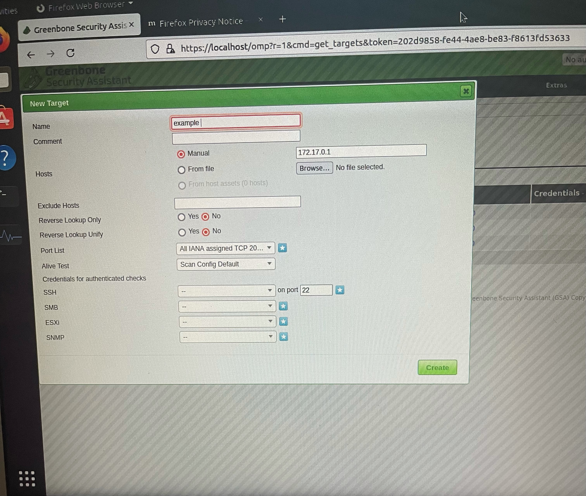

## Docker install

You can use refer to these pages as an installation guide for docker on ubuntu

The first step is running apt update
```markdown
sudo apt-get update
```
Next we want to upgrade 
```markdown
sudo apt-get upgrade
```
Next step to install docker with the command below
```markdown
sudo apt-get install docker.io
```
Ensure it is running 
```markdown
sudo service docker status
```
Start up docker
```markdown
sudo service docker start
```
check status again to ensure docker is running 
```markdown
sudo service docker status
```
Next install the container 
```markdown
sudo docker run -d -p 443:443 --name openvas mikesplain/openvas
```
After that is done installing open a browser and search. You must accept the risk and contiune after search.
```markdown
https://localhost
```
You should now see Greenbone Security Assistant page(openvas) login with
```markdown
username:admin
password:admin
```
Once logged in navigate to Configuration tab at top of tool bar and select a target. Should look image below.
```markdown

```
# Header 1
## Header 2
### Header 3

- Bulleted
- List

1. Numbered
2. List

**Bold** and _Italic_ and `Code` text

[Link](url) and 
```

For more details see [Basic writing and formatting syntax](https://docs.github.com/en/github/writing-on-github/getting-started-with-writing-and-formatting-on-github/basic-writing-and-formatting-syntax).

### Jekyll Themes

Your Pages site will use the layout and styles from the Jekyll theme you have selected in your [repository settings](https://github.com/cck3607/docker/settings/pages). The name of this theme is saved in the Jekyll `_config.yml` configuration file.

### Support or Contact

Having trouble with Pages? Check out our [documentation](https://docs.github.com/categories/github-pages-basics/) or [contact support](https://support.github.com/contact) and we’ll help you sort it out.
